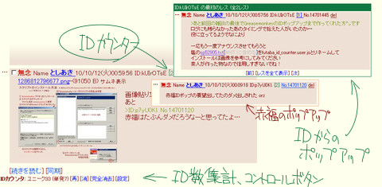

# Futaba ID Counter userscript

ID表示のスレにIDカウンタ※を追加したりする [user script](http://wiki.greasespot.net/User_script) for Greasemonkey。

※IDカウンタ＝IDのその地点までの出現数(レス内の全出現数ではない)

赤福の「続きを読む」にも対応 (稀にバグる可能性あり?)

## 機能

+ IDカウンタ付加:
  ID:xxxx の横に同IDのそれまでの出現回数を[2]のように表示する
  * 単発IDには表示しない(変更可能)
  * スレあきのIDには印を付けて特別視する
  * カウンタ部のクリックでそのIDの次のレスへスクロールする(+SHIFTで前のレスへ)

+ ID集計:
  スレ末尾にスレ内IDのユニーク数(単発ID数)を表示する

+ IDポップアップ:
  ID表現(のある行)／IDカウンタをポイント → 同IDのレスをポップアップ表示
  * 1レス目・レス中のID表現からは他の全レスを、2レス目以降では(内容のある)1レス目を
  * 1レス目表示 → (他の)全レス表示への切り替え
  * ポップアップ中のIDカウンタ部クリックでそのレスの場所へスクロール

## 既知の問題

* 赤福の「続きを読む」の場合でもいちいち全体を走査し直す仕様なので
  長いスレだとその処理が大変かもしれない。効率とか考えてない。

* IDカウンタ付きで保存しても動的要素は働かない。保存するときは全消ししておこう。

* 赤福を騙すために埋め込む非表示テキスト(ID: No.)がレスの引用などで発覚する。
  赤福のコードを読むに、この方式では回避しようがない。
  → テキスト中IDポップアップ機能で代替すれば問題ない

* IDポップアップ
  * 赤福のそれに似せてるけど別物なので、いろいろと挙動が違う。合わせるのめどい。
  * 画面右端付近で開かれるとサイズがきつくなる。水平方向は調整していないから。
  * 引用したレスのNo.に赤福が反応してポップアップする。意図していないが問題じゃないから放置。
  * 赤福のポップアップにマウスを動かすとこちらのポップアップは消える。別にいいよね？
  * 赤福ポップアップ内のIDカウンタからはIDポップアップしない(IDテキスト自体からはポップアップできるからまあいいか)
  * [解決済？] IDポップアップ表示中に赤福の「続きを読む」等を行うとスレが壊れる。(バグ報告)
    →場当たり的に対策(検知してポップアップを消すように)
  * IDポップアップ中の引用から赤福ポップアップすると順序的に変なレスに反応する（IDポップアップ内も引用の検索範囲になっている）
  * ID:xxxx の真上だけでなく同じ行にIDがあればポップアップしてしまう(赤福のNo.ポップアップと似たような挙動)
  * IDが一行に複数でてくる場合(稀だろうが)に、最初のIDしか関知しない。

## Greasemonkey関係FAQ

* MHTにはGreasemonkeyは標準では反応しない。
  about:config から greasemonkey.unmhtIsGreaseable を true に設定すればOK。

* ローカルファイルに対して使うには greasemonkey.fileIsGreaseable を true に。

## カスタマイズ

挙動は設定ボタンから多少変更が出来る。この設定の初期値は、スクリプト冒頭の大文字変数を*エディタで編集*すれば変更することができる。

+ USE\_THREAKI\_SIGN:
  スレあきのIDに印を付ける
  (_true_)

+ USE\_SOLO\_ID\_EXCEPTION:
  単発IDにはIDカウンタを付けない
  (_true_)

+ USE\_ID\_JUMP\_ON\_CLICK
  IDカウンタクリックで次/前(Shift)のID出現箇所へスクロールする
  (_true_)

同IDレスのポップアップ関係

+ USE\_ID\_POPUP:
  IDカウンタのマウスオーバーで同IDのレスをポップアップ表示
  (_true_)

+ USE\_ID\_POPUP\_FOR\_TEXT:
  テキスト中のIDからポップアップ
  (_true_)

+ ID\_POPUP\_FIRST\_OTHERS:
  最初のレスのIDポップアップでは他の全てのレス表示
  (_true_)

+ ID\_POPUP\_ALWAYS\_OTHERS:
  IDポップアップは常に他の全てのレス表示（最初のレスだけでなく）
  (_false_)

パラメータ

+ ID\_POPUP\_IMG\_SCALE:
  ポップアップ中の画像のサイズ比
  _(0.5)_

+ ID\_POPUP\_FONTSIZE:
  ポップアップの文字サイズ
  _'75%'_

+ THREAKI\_SIGN:
  スレあきのIDに付ける印
  (_'*'_)

